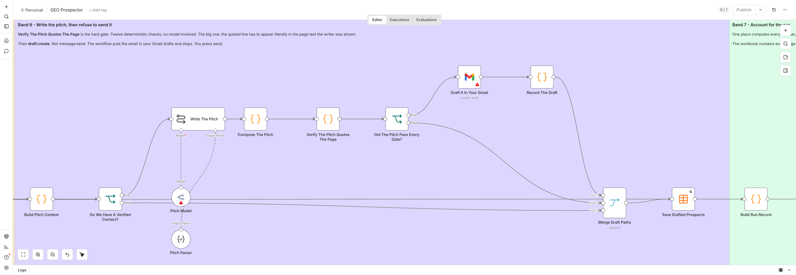
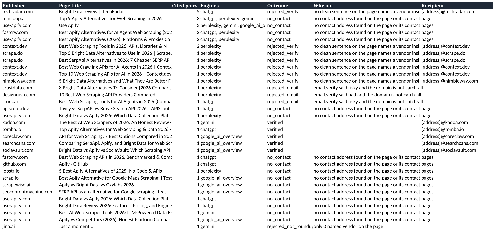

# GEO Outreach Engine for n8n

Find the third-party pages ChatGPT, Perplexity, Gemini and Google AI Overviews cite when someone
asks for the best tool in your category, prove those pages are pitchable, find the person who wrote
them, and put a ready-to-send draft in your Gmail.

Discovery, scraping, contact finding and email verification run through [AnyAPI](https://getanyapi.com),
which is one key and one wallet across all of it, billed per request in real dollars.

**The workflow never sends anything.** It writes Gmail drafts. You press send.



## Why this and not keyword rankings

When someone asks an assistant for the best tool in your category, it does not read your website and
form an opinion. It reads a handful of other people's pages and recommends whoever is named on them.
So the useful question is not "where do I rank", it is "which pages does the model quote, and am I on
them".

This workflow answers the first half by asking four engines the same buyer questions and scoring every
cited URL by how many distinct (prompt, engine) pairs cite it. A page three engines cite for two
prompts is structurally trusted. A page one engine cited once is a fluke.

It answers the second half by reading each page, checking you are not already on it, finding the
author, and writing a pitch that quotes a line the page actually contains.

## Which file to import

| File | What it is |
| --- | --- |
| `geo-outreach-prospector.workflow.json` | The full run. Needs an OpenRouter credential for the profiling, ownership and pitch steps |
| `geo-outreach-prospector-lite.workflow.json` | The same pipeline with zero LLM calls. No OpenRouter credential, no model anywhere |
| `geo-outreach-followup.workflow.json` | A daily pass that reads each thread and drafts one follow-up when it is due |

Both prospectors do the same discovery, the same ownership filter, the same roundup proof, the same
contact ladder, the same email verification and **the same twelve-check pitch gate**. Lite drops the model steps. Every safety gate still runs.

The measured run below is the lite tier, so every number in it is deterministic.

## What it actually found

One real run, lite tier, pointed at getanyapi.com. Every number here is in
[samples/measured-output.json](samples/measured-output.json) and `npm run verify` refuses the
package if the README and the sample disagree.

| Stage | Count |
| --- | ---: |
| Buyer questions asked | 8 |
| Engine calls | 32 |
| Engine calls that failed | 3 |
| Times AnyAPI was mentioned in an answer | 0 of 21 |
| Times AnyAPI was cited in an answer | 0 of 21 |
| Cited URLs harvested | 130 |
| Owned by a rival | 63 |
| A vendor's own product page | 18 |
| A platform you cannot pitch | 17 |
| **Left to pitch** | **32** |
| Pages read | 32 |
| Rejected as not a real roundup | 1 |
| Contact found on the page itself | 10 |
| Contact found on a contact page | 5 |
| No contact anywhere | 16 |
| Addresses that passed verification | 12 |
| Pitches written | 12 |
| **Pitches that passed all twelve gates** | **5** |
| Pitches the gates rejected | 7 |

**AnyAPI cost for the whole run: $0.155420 across 122 calls, in 23 minutes.**

The first line of that table is the reason the workflow exists. Across 21 prompt and engine pairs,
not one answer mentioned AnyAPI, and not one cited it. Meanwhile 63 of the 130 pages the engines
did cite belong to a competitor, which is what winning looks like from the other side.

The workbook lists all 32 pages, with the outcome and the reason for every refusal.



Recipient addresses are masked in that screenshot. They are not masked in the workbook the workflow
writes for you.

Here is one of the five drafts, exactly as the workflow composed it. The line in quotes is on their
page, which is the one thing the gate will not let a draft skip:

```
To: [address]@searchcans.com
Subject: AnyAPI for "Comparing SerpApi, Apify, and Bright Data for Web Scraping in 2026"

Hi there,

I was checking which pages come up when people ask an AI assistant for the best scraping API,
and yours is one of them: https://searchcans.com/blog/serpapi-apify-bright-data-comparison

This line is what made me write:

"SerpApi, Apify, and Bright Data represent three distinct philosophies in the web scraping and
data extraction space, each with a core architectural focus that dictates its strengths and
ideal use cases."

You already cover Apify there, and AnyAPI solves the same problem for the same reader.

AnyAPI is 1,200+ scraping and data APIs behind one key. Pay per request in real dollars. No
subscriptions, nothing monthly, nothing to cancel. If it is a fit for the list, I am happy to
send whatever you need to evaluate it: access, pricing, or a short written summary. If it is
not a fit, no problem at all and thanks for the work you already put into that page.

Kevin Wang
Founder, AnyAPI
https://getanyapi.com
```

Seven pitches did not survive the gate, and that is the part worth reading in
[PROOF.md](PROOF.md). The lite composer refuses to invent a sentence, so when a page has no clean
sentence naming a vendor it produces nothing and the prospect is dropped.

## The step everyone gets wrong

Three real bugs, each found by running the thing rather than by reading the docs.

### 1. n8n's retry does nothing on these nodes

Every AnyAPI call here sets `neverError` so the workflow can read the status code and tell an empty
answer, which is a charged 200 with `found:false`, from a failure. What that also does is switch off
`retryOnFail`, because n8n only retries a node that throws or whose **first** output item carries an
error. A `retryOnFail: true` sitting next to `neverError: true` is decoration.

Measured: 19 of 28 page scrapes came back 502 in about 70 milliseconds each, an upstream lane having
a bad minute. Every one of those URLs read fine a few minutes later. With the decorative retry the
run kept 9 pages. The fix is the retry branch you can see on the canvas in band 4, and `verify.mjs`
now fails the package if any node claims both settings.

### 2. `email.verify` does not say what the schema example says

The gate was written against `valid` / `deliverable`. The provider returns `good`, `risky` and
`bad`, with a 0 to 100 score and a `catchAll` flag. So a `good` address scoring 100 was thrown away
along with every catch-all publisher, and a run that had verified addresses produced zero drafts.

The gate now reads the flags rather than the word: deliverable statuses pass, disposable and free
always fail, and `risky` passes only when the domain is genuinely catch-all. Most publishers are
behind a catch-all. Dropping them drops the entire point.

### 3. `409` is two different things wearing one status code

`idempotency_conflict` means you reused a key for a different body, which is a bug in the key
formula and worth stopping the run for. `idempotency_in_progress` just means the identical call is
still running somewhere. The first version treated any 409 as fatal, and a re-run inside the replay
window killed itself on a transient one.

While we are here: n8n's `httpRequest` default timeout is 10000 ms, and the brand-visibility SKUs
have a 71 second upstream ceiling with 125 seconds on the AI Overview rescue lane. On the default
every engine call aborts before the engine answers. The timeouts in this workflow are 90000 and
150000 for exactly that reason.

And one from reading the source rather than running it: **do not build the reply watcher on the
Gmail trigger.** Above `typeVersion` 1.2 it discards messages carrying the `SENT` label unless they
also carry `INBOX`, so it can never see you sending. The follow-up workflow reads the thread instead,
which answers sent, replied and due in one call.

## How it works

1. **Onboard.** One form. It scrapes your own site once, then builds the buyer questions your
   customers would actually type. Pro asks a model and then throws away every proposed question that
   is not shaped like a recommendation, does not mention your category, or names you. Lite builds the
   same shapes from templates.
2. **Ask the engines.** Every question goes to ChatGPT, Perplexity, Gemini and Google AI Overviews in
   parallel. Each call carries an `Idempotency-Key` computed one node earlier as a data field, never
   as an inline expression, because an inline expression is re-evaluated on retry and charges you
   twice.
3. **Harvest and filter.** Score each cited URL by distinct (prompt, engine) pairs. Then drop
   everything you cannot pitch: your own pages, pages a rival owns, and platforms where you get
   listed through a vendor flow rather than by emailing an author. Pro can narrow this further with a
   model, and the model is only ever allowed to narrow: it can move a page out of `third_party` and
   can never move one in, so a hallucination costs you a lead and can never produce a wrong draft.
4. **Read the page.** One cheap scrape per surviving page. A page has to name two different vendors
   to count as a roundup, because one brand is a product page and a roundup is plural by definition.
   A page that already names you gets recorded and never pitched.
5. **Find the human.** `email.find` costs 44 times what a page scrape costs, so the ladder is: the
   mailto already on the page, then two contact pages, then pay. Free providers, off-domain addresses
   and do-not-mail role accounts are dropped before anything is verified.
6. **Write the pitch, then refuse to send it.** The pitch is checked by twelve deterministic
   conditions with no model involved, and only then does `draft:create` put it in your Gmail.
7. **Account for the run.** One node computes every number, so the workbook, the summary email and
   the Data Table row cannot disagree. The workbook contains every page the run looked at, including
   the refusals and the reason for each.

Then, daily: the follow-up workflow reads each thread. No `SENT` label means you have not pressed
send, so it does nothing. A message from somebody else means you got a reply, so it stops. An unsent
draft still in the thread means one is already waiting for you, so it does nothing. Only a sent
thread with no reply and the gap elapsed gets a threaded follow-up draft.

## Setup

1. Import the workflow JSON you want. It arrives inactive, with no credentials and no Data Table ids.
2. Get an AnyAPI key at [getanyapi.com](https://getanyapi.com). New keys start with $0.10 of credit,
   which is about 100 requests, and a full lite run costs a fraction of that.
3. Create a **Header Auth** credential in n8n named however you like, header `Authorization`, value
   `Bearer YOUR_ANYAPI_KEY`, and assign it to every HTTP Request node.
4. Create the five Data Tables below, then replace every `YOUR_DATA_TABLE_ID` in the imported
   workflow with the matching table.
5. Assign a Gmail OAuth2 credential to the draft nodes and to the summary node.
6. Pro only: assign an OpenRouter credential to the three model nodes.
7. Run the form once. Read the drafts in Gmail before you send anything.

The workflow uses `n8n-nodes-base.httpRequest` rather than the AnyAPI community node, for two concrete
reasons. The community node builds its request from method, URL, body and query string only, so
it cannot carry an `Idempotency-Key` and cannot set a timeout, and both of those are load-bearing
here. If you are editing the workflow by hand the community node is friendlier, and for anything
short and cheap it is the better tool.

### Data Tables

| Table | What it holds |
| --- | --- |
| `geo_config` | One row, `key = default`. Your identity, competitors, blocked domains, follow-up settings, spend ceiling |
| `geo_profile` | One row, `key = default`. The business profile and the buyer prompts |
| `geo_prospects` | One row per page, from `discovered` through to `replied`. Carries the draft, message and thread ids |
| `geo_runs` | One row per run. Every counter in this README comes from these columns |
| `geo_suppression` | Addresses and domains that must never be drafted to again |

The exact columns are in the Data Table nodes inside the workflow, and every column the workflow
writes is listed there with its type.

## What it refuses to do

This is a published tool that composes email on your behalf, so the refusals matter more than the
features. All of these are enforced in code. None of them rely on a prompt.

1. **It never sends.** There is no `message:send` to a prospect anywhere in the package. The only
   thing it emails is the run summary, to you. `verify.mjs` fails if that ever stops being true.
2. **It never quotes a line that is not on the page.** The quoted snippet has to appear literally in
   the page text the writer was shown, and again inside the email body.
3. **It never invents a link.** The only URLs allowed in a draft are the page itself and your own
   domain. The page URL has to appear exactly once.
4. **It never invents a relationship.** No "as we discussed", no "following up on our call", no `Re:`
   on a first touch.
5. **It never greets somebody it cannot name**, and never omits the name of somebody it can.
6. **It never writes to an address off the page's own domain**, to a free provider, or to
   `abuse@`, `postmaster@`, `security@`, `legal@`, `privacy@`, `dmca@` or any `noreply` variant.
   `editor@` and `tips@` are kept on purpose: for editorial outreach those are the right address.
7. **It never writes to an address `email.verify` calls disposable or undeliverable.**
8. **It never pitches a page you or a competitor owns**, or a platform where listings are not an
   editorial decision.
9. **It never pitches a page that already names you.** That gets recorded and dropped.
10. **It never lets a model widen anything.** The ownership model may only narrow the set. The pitch
    model writes text that twelve deterministic conditions then have to accept.
11. **It never drafts a follow-up into a thread you have not sent**, or one that somebody has
    replied to, or more than `max_followups` times.
12. **It never retries a paid call without an idempotency key.**

## Swap in your own prompts

The buyer questions are the whole experiment, and the defaults are just a starting shape. In lite,
open `Confirm Your Business Profile` and edit the template list. In pro, edit the system message on
`Profile Your Business`, and note that `Confirm Your Business Profile` will still throw away anything
that is not a recommendation-shaped question, does not mention your category, or names your own brand.

Prompts that work here look like "best contract analytics software for mid-market legal teams",
"alternatives to Rival One", "Rival One vs Rival Two". Prompts that do not work look like "what does
Acme do", because that returns your own pages and measures nothing.

More prompts means more coverage and more spend, in a straight line: three visibility calls plus one
AI Overview per prompt. There is no cap on prompts, pages, contacts or drafts anywhere in this
workflow. Your spend ceiling is the only governor, and it is checked before the engine fan-out and
again before each `email.find`.

## Honest caveats

- **It finds the pages models cite today and drafts the pitch. It cannot make an editor say yes**,
  and it cannot prove a placement changed an engine's answer. The only way to know that is to re-run
  the same buyer prompts later and compare, which costs three visibility calls per prompt.
- Engines are not stable. Ask the same question twice and you can get different citations, and any
  single engine can be down for a whole run. The workflow degrades and counts the failures instead of
  pretending they did not happen.
- The cheap `web.scrape` lane does not run stealth, so some publishers will not open for it.
- The ownership filter knows your own domain, the competitors you listed, the brands the engines
  named, and any page whose title leads with the site's own brand. A vendor's blog that nobody
  named still reads as third party, so one will reach your drafts now and then. The workbook shows
  you which, and you are the one pressing send.
- A verified address means the mailbox accepts mail. It does not mean the person still works there
  or wants your email.
- The pitch is only as good as your value proposition. The workflow makes it accurate, not
  persuasive.

## Cost

Published AnyAPI prices per request, which are what the cost model in the workflow uses:

| Call | Price |
| --- | --- |
| ChatGPT / Perplexity / Gemini brand visibility | $0.0045 each |
| `google.ai_overview` | up to $0.00163 |
| `google.search` | $0.00099 to $0.00126 |
| `web.scrape`, cheap lane | $0.0005 |
| `email.find` | $0.0221 |
| `email.verify` | $0.00084 |
| Every Gmail draft and every follow-up | $0 |

The spend concentrates in two places: brand visibility and `email.find`. That is why the contact
ladder tries free options first, and why the ceiling is checked immediately before each `email.find`.

Drafting is free, so the expensive half of outreach is the half this workflow does once.

## Verify the package

```bash
npm run verify
```

It checks that the exports are inactive and carry no credentials, pin data, webhook ids or Data Table
ids; that every Code node parses and every node reference resolves; that no Gmail node in the package
can send to a prospect; that every paid call carries an idempotency key read from a data field, a
timeout above n8n's default, and a readable status code; that every measured draft quotes text that
is literally in the recorded page; and that every number in this README, in PROOF.md and in the post
draft is either measured or an explained constant.

To reproduce the measured run:

```bash
ANYAPI_API_KEY=your_key npm run proof
```

That runs the Code nodes straight out of the shipped lite workflow against real AnyAPI calls and
rewrites `samples/measured-output.json`. It does not call Gmail.

## License

MIT
