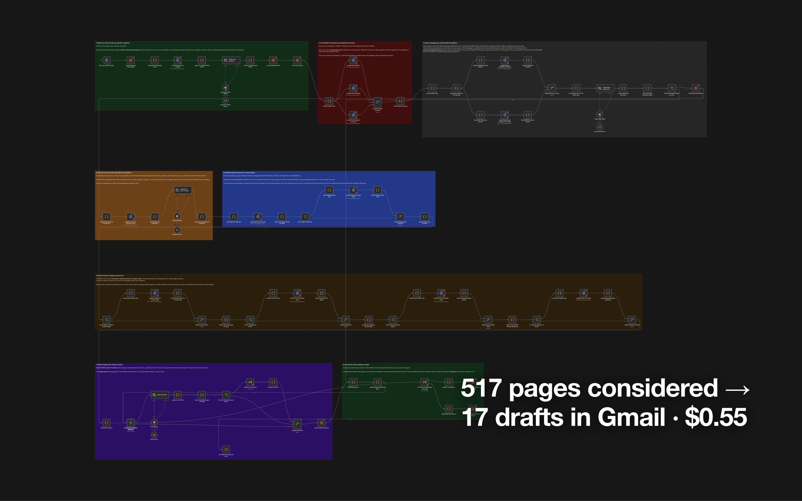

# GEO Outreach Engine for n8n

Find the third-party pages ChatGPT, Perplexity and Google AI Overviews cite when someone asks for
the best tool in your category, prove those pages are pitchable, find the person who wrote them, and
put a ready-to-send draft in your Gmail.

Discovery, scraping, contact finding and email verification run through [AnyAPI](https://getanyapi.com),
which is one key and one wallet across all of it, billed per request in real dollars.

**The workflow never sends anything.** It writes Gmail drafts. You press send.



## Why this and not keyword rankings

When someone asks an assistant for the best tool in your category, it does not read your website and
form an opinion. It reads a handful of other people's pages and recommends whoever is named on them.
So the useful question is not "where do I rank", it is "which pages does the model quote, and am I on
them".

This workflow answers the first half by asking three engines the same buyer questions and scoring every
cited URL by how many distinct (prompt, engine) pairs cite it. A page three engines cite for two
prompts is structurally trusted. A page one engine cited once is a fluke.

It answers the second half by reading each page, checking you are not already on it, finding the
author, and writing a pitch that quotes a line the page actually contains.

## Which file to import

| File | What it is |
| --- | --- |
| `geo-outreach-prospector.workflow.json` | The full run. Needs an OpenRouter credential for the profiling, ownership, publisher and pitch steps |
| `geo-outreach-followup.workflow.json` | A daily pass that reads each thread and drafts one follow-up when it is due |

There was a second, model-free tier here. It is gone, and the reason is worth saying plainly: the
step that keeps this thing from emailing your competitors is a judgement about who runs a website,
and no template makes that judgement. A tier without a model was a tier that pitched rivals.

## What it actually found

One real run, pointed at getanyapi.com. Every number here is in
[samples/measured-output-pro.json](samples/measured-output-pro.json) and `npm run verify` refuses
the package if the README and the sample disagree.

| Stage | Count |
| --- | ---: |
| Buyer questions asked | 17 |
| Engine calls | 51 |
| Engine calls that failed | 3 |
| Times AnyAPI was mentioned in an answer | 0 of 39 |
| Times AnyAPI was cited in an answer | 0 of 39 |
| Cited URLs harvested | 471 |
| Pages considered | 517 |
| Owned by a rival | 94 |
| A vendor's own product page | 31 |
| A platform you cannot pitch | 58 |
| Sites judged a vendor from their own home page | 106 |
| Sites judged an independent publisher | 78 |
| Pages read | 104 |
| Rejected as not a real roundup | 65 |
| Contact found on the page itself | 15 |
| Contact found on a contact page | 4 |
| Contact bought from `email.find` | 6 |
| No contact anywhere | 14 |
| Addresses that passed verification | 19 |
| Pitches written | 19 |
| **Pitches that passed all thirteen gates** | **17** |
| Pitches the gates rejected | 2 |

**AnyAPI cost for the whole run: $0.555590 across 450 calls, in 12 minutes.** The model calls added
$0.035604 on top.

The first line of that table is the reason the workflow exists. Across 39 prompt and engine pairs,
not one answer mentioned AnyAPI, and not one cited it. Meanwhile 94 of the 517 pages the engines
did cite belong to a competitor, which is what winning looks like from the other side.

The line under it is the one that took the longest to get right. 106 of the 184 sites that survived
the cheap filters turned out, on reading their own home page, to be selling something in the same
category. Emailing those is not neutral: it is asking a competitor to list you, which is a worse
outcome than never finding the page at all.

The workbook lists all 104 pages, with the outcome and the reason for every refusal.

Here is one of the seventeen drafts, exactly as the workflow composed it:

```
To: folks@folk.app
Subject: AnyAPI for your 13 Best LinkedIn Data Scrapers list

Hi Simo,

I'm Kevin Wang from AnyAPI, access 327 scraping and data APIs behind one key with automatic
failover and pay-per-request billing from a prepaid USD wallet with no subscription or idle fees.

I came across your piece "13 Best LinkedIn Data Scrapers (2026 List)" and thought AnyAPI could
be a relevant addition for your readers - you detail extracting profile data from Sales
Navigator lists and Chrome extensions but don't cover API options that fit B2B lead enrichment
without subscriptions.

Would this be something you would be open to?

Best,
Kevin Wang
Founder @ AnyAPI
https://getanyapi.com
```

Six lines, one of which is about them. That shape is deliberate and it is the part that changed
most. An earlier version quoted a sentence from the page back at its own editor, which reads
exactly like what it was: a scraper had been there. The quote is still required and still checked
character for character against the page, because it is the proof the writer read the piece rather
than guessing from the title. It just belongs in the workbook, where you can check it, rather than
in the email, where the recipient already knows what their page says.

The model writes two things: the subject, and the one clause after the dash. Everything else -
greeting, the line about who you are, the offer back, the closing question, the signature - is
placed by code. That split exists because three consecutive runs each lost every draft to a
different forgotten part.

The line about who you are is the first sentence of the value proposition you typed on the form,
placed unchanged. It is not shortened to fit. Three separate runs shipped drafts ending "eliminating
idle costs and.", "billing from a." and "wallet with no.", each one a character limit cutting a
sentence and each fix a longer list of words to strip off the end. The limit was the bug.

## The step everyone gets wrong

Four real bugs, each found by running the thing rather than by reading the docs.

### 1. n8n's retry does nothing on these nodes

Every AnyAPI call here sets `neverError` so the workflow can read the status code and tell an empty
answer, which is a charged 200 with `found:false`, from a failure. What that also does is switch off
`retryOnFail`, because n8n only retries a node that throws or whose **first** output item carries an
error. A `retryOnFail: true` sitting next to `neverError: true` is decoration.

Measured: 19 of 28 page scrapes came back 502 in about 70 milliseconds each, an upstream lane having
a bad minute. Every one of those URLs read fine a few minutes later. With the decorative retry the
run kept 9 pages. The fix is the retry branch you can see on the canvas in band 4, and `verify.mjs`
now fails the package if any node claims both settings.

### 2. `email.verify` does not say what the schema example says

The gate was written against `valid` / `deliverable`. The provider returns `good`, `risky` and
`bad`, with a 0 to 100 score and a `catchAll` flag. So a `good` address scoring 100 was thrown away
along with every catch-all publisher, and a run that had verified addresses produced zero drafts.

The gate now reads the flags rather than the word: deliverable statuses pass, disposable and free
always fail, and `risky` passes only when the domain is genuinely catch-all. Most publishers are
behind a catch-all. Dropping them drops the entire point.

### 3. `409` is two different things wearing one status code

`idempotency_conflict` means you reused a key for a different body, which is a bug in the key
formula and worth stopping the run for. `idempotency_in_progress` just means the identical call is
still running somewhere. The first version treated any 409 as fatal, and a re-run inside the replay
window killed itself on a transient one.

While we are here: n8n's `httpRequest` default timeout is 10000 ms and every engine call takes far
longer than that, so on the default every one of them aborts before the engine answers. The engine
timeouts here are 180000, 120000 and 240000, each set from what that engine actually takes.

### 4. n8n fires every item at once, and they share one clock

`httpRequest` launches all of a node's items together and gives each the same per-node timeout. On a
node carrying a few hundred pages the last requests sit in the connection queue burning their own
clock before the server ever sees them. Measured: a run died with `This operation was aborted` at
roughly 300 concurrent scrapes, having completed 146 calls cleanly earlier in the same run at lower
concurrency. The fan-out nodes set `batching` for that reason, and nothing else in this workflow
changed to fix it.

And one from reading the source rather than running it: **do not build the reply watcher on the
Gmail trigger.** Above `typeVersion` 1.2 it discards messages carrying the `SENT` label unless they
also carry `INBOX`, so it can never see you sending. The follow-up workflow reads the thread instead,
which answers sent, replied and due in one call.

## How it works

1. **Onboard.** One form. It scrapes your own site once, then builds the buyer questions your
   customers would actually type. A model proposes them and then every proposed question that is not
   shaped like a recommendation, does not mention your category, or names you is thrown away.
2. **Ask the engines.** Every question goes to ChatGPT, Perplexity and Google AI Overviews in
   parallel. Each call carries an `Idempotency-Key` computed one node earlier as a data field, never
   as an inline expression, because an inline expression is re-evaluated on retry and charges you
   twice.
3. **Harvest and filter.** Score each cited URL by distinct (prompt, engine) pairs. Then drop
   everything you cannot pitch: your own pages, pages a rival owns, and platforms where you get
   listed through a vendor flow rather than by emailing an author. A model narrows this further, and
   it is only ever allowed to narrow: it can move a page out of `third_party` and can never move one
   in, so a hallucination costs you a lead and can never produce a wrong draft.
4. **Ask who runs the site.** The cheapest scrape there is, one per surviving domain, and a model
   reads that home page and answers one question: does this site sell something a buyer asking your
   questions would consider? It is shown those questions rather than a description of your market,
   because a category is a phrase and a phrase is not a market. Vendors are dropped here, before
   anything expensive happens to them.
5. **Read the page.** One cheap scrape per surviving page. A page has to name two different vendors
   to count as a roundup, because one brand is a product page and a roundup is plural by definition.
   A page that already names you gets recorded and never pitched.
6. **Find the human.** `email.find` costs 44 times what a page scrape costs, so the ladder is: the
   mailto already on the page, then two contact pages, then the domain's published editor, then pay.
   Free providers, off-domain addresses and do-not-mail role accounts are dropped before anything is
   verified. One person gets one draft per run, however many of their pages qualified.
7. **Write the pitch, then refuse to send it.** The pitch is checked by thirteen deterministic
   conditions with no model involved, and only then does `draft:create` put it in your Gmail.
8. **Account for the run.** One node computes every number by reading every paid node, so the
   workbook, the summary email and the Data Table row cannot disagree with each other or with your
   bill. The workbook contains every page the run looked at, including the refusals and the reason
   for each.

Then, daily: the follow-up workflow reads each thread. No `SENT` label means you have not pressed
send, so it does nothing. A message from somebody else means you got a reply, so it stops. An unsent
draft still in the thread means one is already waiting for you, so it does nothing. Only a sent
thread with no reply and the gap elapsed gets a threaded follow-up draft.

## Setup

1. Import the workflow JSON you want. It arrives inactive, with no credentials and no Data Table ids.
2. Get an AnyAPI key at [getanyapi.com](https://getanyapi.com). New keys start with $0.10 of credit,
   which is about 100 requests. The measured run above used 450, so top up before a full run.
3. Create a **Header Auth** credential in n8n named however you like, header `Authorization`, value
   `Bearer YOUR_ANYAPI_KEY`, and assign it to every HTTP Request node.
4. Create the five Data Tables below, then replace every `YOUR_DATA_TABLE_ID` in the imported
   workflow with the matching table.
5. Assign a Gmail OAuth2 credential to the draft nodes and to the summary node.
6. Assign an OpenRouter credential to the four model nodes.
7. Run the form once. Read the drafts in Gmail before you send anything.

The workflow uses `n8n-nodes-base.httpRequest` rather than the AnyAPI community node, for two concrete
reasons. The community node builds its request from method, URL, body and query string only, so
it cannot carry an `Idempotency-Key` and cannot set a timeout, and both of those are load-bearing
here. If you are editing the workflow by hand the community node is friendlier, and for anything
short and cheap it is the better tool.

### Data Tables

| Table | What it holds |
| --- | --- |
| `geo_config` | One row, `key = default`. Your identity, competitors, blocked domains, follow-up settings, spend ceiling |
| `geo_profile` | One row, `key = default`. The business profile and the buyer prompts |
| `geo_prospects` | One row per page, from `discovered` through to `replied`. Carries the draft, message and thread ids |
| `geo_runs` | One row per run. Every counter in this README comes from these columns |
| `geo_suppression` | Addresses and domains that must never be drafted to again |

The exact columns are in the Data Table nodes inside the workflow, and every column the workflow
writes is listed there with its type.

## What it refuses to do

This is a published tool that composes email on your behalf, so the refusals matter more than the
features. All of these are enforced in code. None of them rely on a prompt.

1. **It never sends.** There is no `message:send` to a prospect anywhere in the package. The only
   thing it emails is the run summary, to you. `verify.mjs` fails if that ever stops being true.
2. **It never claims to have read a page it did not read.** The writer has to return a run of at
   least forty characters copied character for character out of the page text it was shown. That
   snippet is not printed in the email; it is kept in the workbook so you can check it.
3. **It never names a vendor who is not on the page.** The name has to be one the engines named and
   one that appears in the page's own markdown.
4. **It never invents a link.** The only URLs allowed in a draft are the page itself and your own
   domain, and the page URL may appear at most once.
5. **It never invents a relationship.** No "as we discussed", no "following up on our call", no `Re:`
   on a first touch.
6. **It never greets somebody it cannot name**, and never omits the name of somebody it can.
7. **It never promises anything you did not configure.** The offer back is a verb phrase you type on
   the form, placed verbatim. Type nothing and the email offers nothing; a draft that invents an
   offer is thrown away.
8. **It never writes to an address off the page's own domain**, to a free provider, or to
   `abuse@`, `postmaster@`, `security@`, `legal@`, `privacy@`, `dmca@` or any `noreply` variant.
   `editor@` and `tips@` are kept on purpose: for editorial outreach those are the right address.
9. **It never writes to an address `email.verify` calls disposable or undeliverable.**
10. **It never writes to the same person twice in a run**, however many of their pages qualified.
11. **It never pitches a page you or a competitor owns**, a site that sells in your category, or a
    platform where listings are not an editorial decision.
12. **It never pitches a page that already names you.** That gets recorded and dropped.
13. **It never lets a model widen anything.** The ownership model may only narrow the set. The pitch
    model writes text that thirteen deterministic conditions then have to accept.
14. **It never drafts a follow-up into a thread you have not sent**, or one that somebody has
    replied to, or more than `max_followups` times.
15. **It never retries a paid call without an idempotency key.**

## Swap in your own prompts

The buyer questions are the whole experiment, and the defaults are just a starting shape. Edit the
system message on `Profile Your Business`, and note that `Confirm Your Business Profile` will still
throw away anything that is not a recommendation-shaped question, does not mention your category, or
names your own brand.

Prompts that work here look like "best contract analytics software for mid-market legal teams",
"alternatives to Rival One", "Rival One vs Rival Two". Prompts that do not work look like "what does
Acme do", because that returns your own pages and measures nothing.

More prompts means more coverage and more spend, in a straight line: three engine calls per prompt. There is no cap on prompts, pages, contacts or drafts anywhere in this
workflow. Your spend ceiling is the only governor, and it is checked before the engine fan-out and
again before each `email.find`.

## Honest caveats

- **It finds the pages models cite today and drafts the pitch. It cannot make an editor say yes**,
  and it cannot prove a placement changed an engine's answer. The only way to know that is to re-run
  the same buyer prompts later and compare, which costs three visibility calls per prompt.
- Engines are not stable. Ask the same question twice and you can get different citations, and any
  single engine can be down for a whole run. The workflow degrades and counts the failures instead of
  pretending they did not happen.
- The cheap `web.scrape` lane does not run stealth, so some publishers will not open for it.
- The ownership filter knows your own domain, the competitors you listed, the brands the engines
  named, and any page whose title leads with the site's own brand. A vendor's blog that nobody
  named still reads as third party, so one will reach your drafts now and then. The workbook shows
  you which, and you are the one pressing send.
- A verified address means the mailbox accepts mail. It does not mean the person still works there
  or wants your email.
- The pitch is only as good as your value proposition. The workflow makes it accurate, not
  persuasive.

## Cost

Published AnyAPI prices per request, which are what the cost model in the workflow uses:

| Call | Price |
| --- | --- |
| `chatgpt.search` | $0.0036 |
| `perplexity.search` | $0.0018 |
| `google.ai_overview` | $0.0018 |
| `google.search` | $0.00099 |
| `web.scrape`, cheap lane | $0.0007 |
| `email.find` | $0.0221 |
| `email_finding.hunter_domain` | $0.036 per contact returned, and nothing when it finds nobody |
| `email.verify` | $0.00084 |
| Every Gmail draft and every follow-up | $0 |

The spend concentrates in one place. In the measured run `email.find` was 6 of 450 calls and
$0.161700 of the $0.555590 bill. That is why the contact ladder tries the page, two contact pages and the domain's
published editor before it pays, and why the ceiling is checked immediately before each one.

Drafting is free, so the expensive half of outreach is the half this workflow does once.

## Verify the package

```bash
npm run verify
```

It checks that the exports are inactive and carry no credentials, pin data, webhook ids or Data Table
ids; that every Code node parses and every node reference resolves; that no Gmail node in the package
can send to a prospect; that every paid call carries an idempotency key read from a data field, a
timeout above n8n's default, and a readable status code; that the run record adds up every paid node
so reported spend cannot undercount; that the pitch gate still refuses the drafts it is supposed to;
that one contact address receives one draft per run; that every measured draft quotes text that is
literally in the recorded page; and that every number in this README, in PROOF.md and in the post
draft is either measured or an explained constant.

To reproduce the measured run:

```bash
ANYAPI_API_KEY=your_key npm run proof
```

That runs the Code nodes straight out of the shipped workflow against real AnyAPI calls, and calls
the model nodes' model over OpenRouter, so it needs `OPENROUTER_API_KEY` too. It rewrites
`samples/measured-output-pro.json`. It does not call Gmail.

## License

MIT
